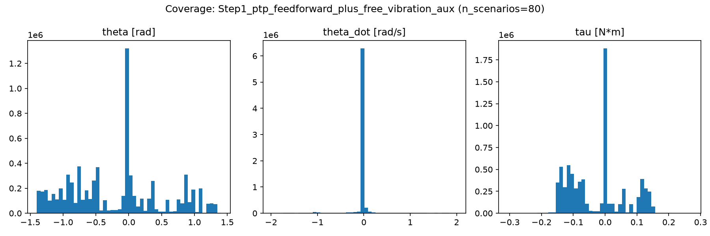
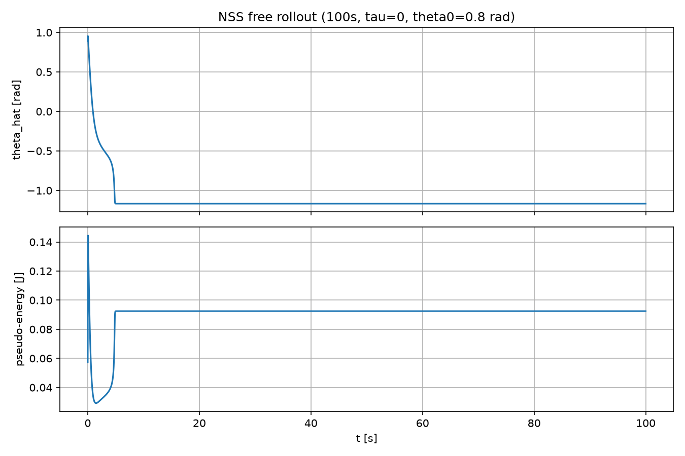
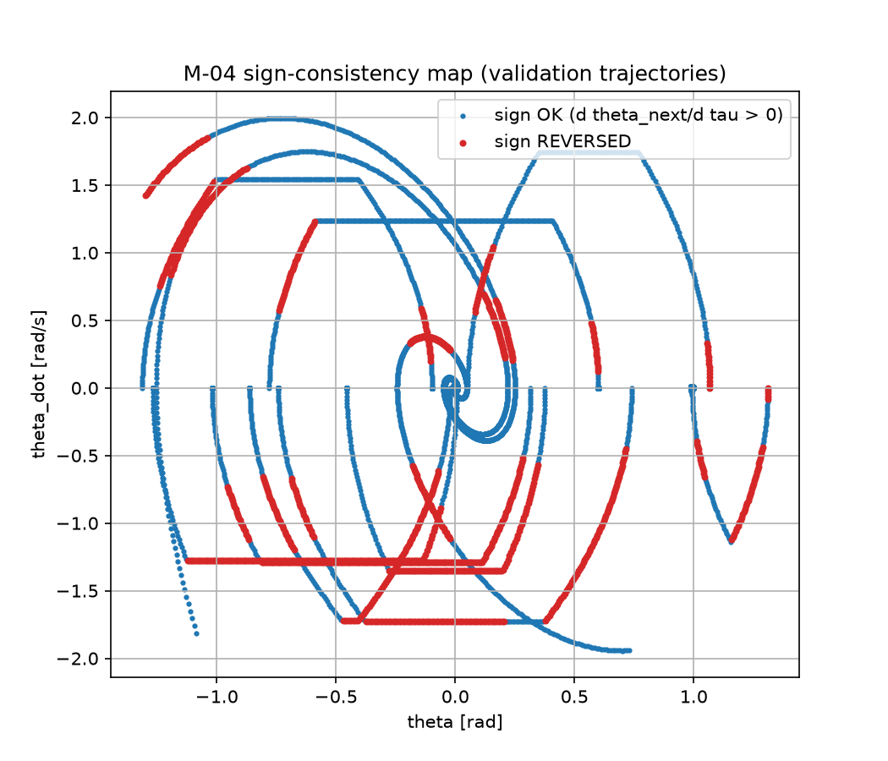
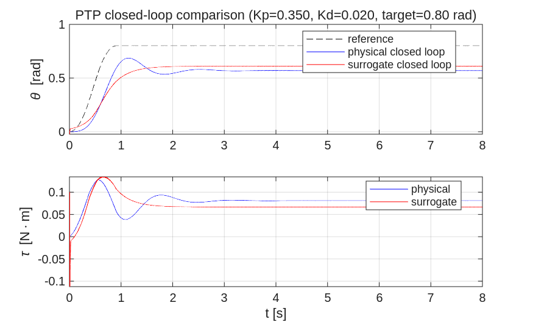
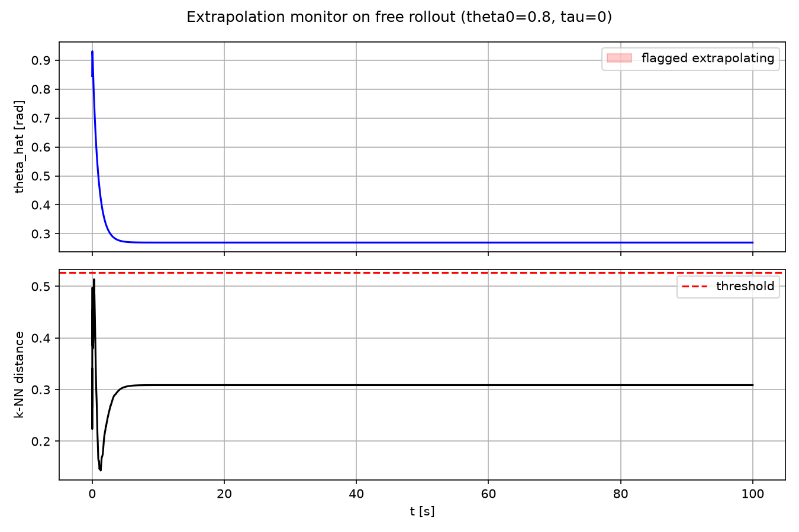

# サロゲートモデル検証レポート:{{対象システム名}}

- 対象: {{単振り子 / 2リンクマニピュレータ / 6軸ロボット等}}
- 状態次元数 n_x: {{2}}
- 生成日: {{YYYY-MM-DD}}
- 対応モデル: {{チェックポイントファイル名}}
- 対応データセット: {{manifest.json のパスとseed}}

> このテンプレートは状態次元数 n_x に依存しない構成になっている。表・図は次元数分の
> 列/系列が増えるだけで、章立ては変更不要。単振り子PoC(n_x=2)ではこのテンプレートに
> 沿って `python/eval_openloop.py`、`eval_stability.py`、`check_sign_consistency.py`、
> `extrapolation_monitor.py`、`matlab/closed_loop_compare.m` の出力をそのまま埋め込んだ。

## 1. 概要

{{本レポートが対象とするモデル・実験の目的を1〜2段落で記述}}

## 2. 学習データカバレッジ

| 項目 | 値 |
|---|---|
| シナリオ数(train/val/test) | {{n_train}} / {{n_val}} / {{n_test}} |
| データ生成段階(Step1/2/3、仕様書§4.1) | {{Step1: PTPフィードフォワードのみ 等}} |
| θ範囲 | {{min, max}} rad |
| θ̇範囲 | {{min, max}} rad/s |
| τ範囲 | {{min, max}} N·m |

## 3. オープンループ検証(仕様書§6.1)

| 検証項目 | 合格基準 | 結果 | 判定 |
|---|---|---|---|
| 長時間自由ロールアウト | 発散なし | max\|状態\| = {{値}} | {{PASS/FAIL}} |
| 平衡点線形化固有値(M-02) | スペクトル半径 < 1 | {{値}} | {{PASS/FAIL}} |
| ゼロ入力エネルギー単調性 | 増加ステップ0 | {{n}}/{{N}} 増加 | {{PASS/FAIL}} |
| 入出力方向整合性(M-04) | 符号反転0% | {{反転率}}% | {{PASS/FAIL}} |

**FAIL項目がある場合の原因切り分け**: {{固有値・符号整合性がPASSならデータ/学習方法側、
両方FAILならアーキテクチャ側、を優先して調査(04_閉ループ組み込みチェックリスト.md参照)}}

## 4. 閉ループ検証(仕様書§6.2)

### 4.1 PTP応答比較

| 指標 | 物理モデル | サロゲート |
|---|---|---|
| 最終追従誤差 | {{値}} rad | {{値}} rad |
| max\|状態\| | {{値}} | {{値}} |
| 発散有無 | {{-}} | {{PASS/DIVERGED}} |

### 4.2 ゲイン感度(発散閾値)

| ゲイン | 物理モデル | サロゲート |
|---|---|---|
| {{Kd値1}} | {{安定/発散}} | {{安定/発散}} |
| {{Kd値2}} | {{安定/発散}} | {{安定/発散}} |

**発散閾値**: {{値}}(物理モデル用ゲインをそのまま使うと{{安全/危険}})

## 5. 発散原因アブレーション実験(仕様書§6.3)

| 実験 | 操作 | 悪化した指標 | 発散原因候補(要件定義書§2) |
|---|---|---|---|
| A. データカバレッジ制限 | {{結果}} | {{指標}} | ①学習データ設計不良 |
| B. 1step損失のみ学習 | {{結果}} | {{指標}} | ③学習方法の問題 |
| C. 活性化関数変更 | {{結果}} | {{指標}} | ②力学的不安定性 |
| D. サンプリング周期不一致 | {{結果}} | {{指標}} | ④離散化不整合 |
| E. ゲイン過大 | {{結果}} | {{指標}} | ⑤ゲイン設計ミスマッチ |
| F. 入出力方向制約なし | {{結果}} | {{指標}} | ②力学的不安定性・受動性の破れ |

## 6. 外挿判定(仕様書§4.2)

| 対象トラジェクトリ | 外挿判定率 | 備考 |
|---|---|---|
| {{正常系}} | {} | {{-}} |

## 7. 結論・既知リスク

- {{本モデルの採否判定}}
- 既知リスク: {{未解決の指標があれば列挙し、対応するIssue番号を記載}}
- 04_閉ループ組み込みチェックリスト.md との対応: {{未チェック項目があれば列挙}}
